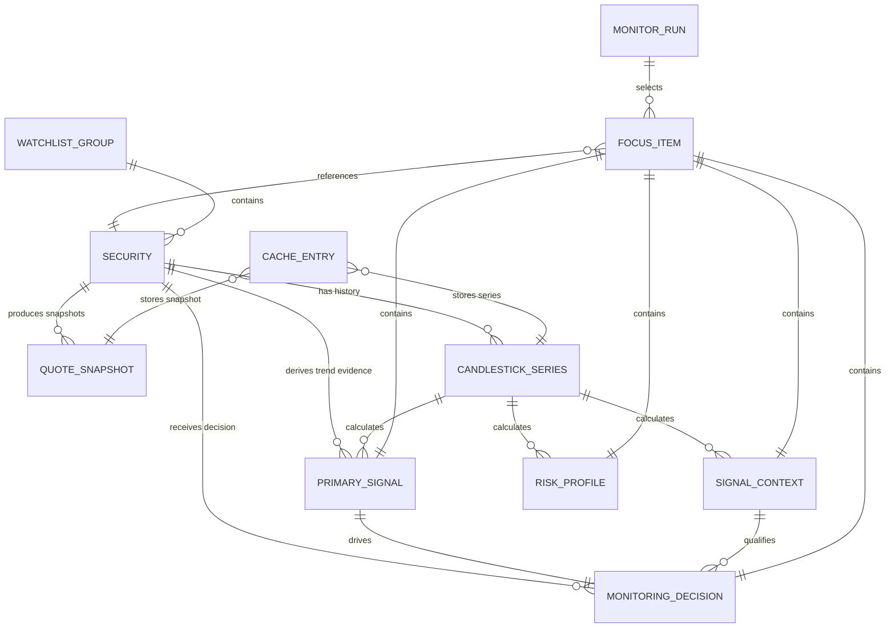

# stk-cli 架构设计

> **Status**: `active`

`stk-cli` 是面向 Agent 与自动化程序消费的股票监控 CLI。系统接收命令行输入，聚合 Longport 与 akshare 数据，输出稳定的 JSON envelope；核心扫描场景是每日监控 100 个以上股票，并筛出需要重点关注的信号标的。

## 系统目标与约束

系统提供 A 股、港股、美股的行情、K 线指标、趋势信号监控、自选股、基本面补充数据和市场新闻查询能力。

核心约束：

- CLI 对 stdout 只输出 JSON envelope；日志和诊断信息输出到 stderr。
- `commands/` 只负责参数解析、服务调用和结果渲染；业务逻辑只放在 `services/`。
- `services/` 返回 Pydantic 模型或模型列表，不直接写 stdout。
- 扫描命令默认输出重点关注标的，不输出观察标的的完整分析明细。
- 扫描输出默认只为推荐信号且辅助态度不冲突的标的附带最近 10 根压缩完整日线，其他标的只保留决策、上下文和风控摘要。
- 每日监控以完整日线 K 线为确认口径；盘前和盘中沿用上一根完整日线，盘后超过市场确认缓冲时间后才纳入当天日线。
- Longport 是跨市场主数据源；akshare 只补充 Longport 未覆盖的 A 股特色数据与新闻数据。
- 用户输入的股票代码进入服务前必须统一为 Longport symbol 语义。
- 本地持久化只用于缓存和 Longport 自选股分组 ID 映射；自选股成员数据归 Longport 服务端所有。
- 外部 SDK 与网络错误必须在服务边界翻译为 `StkError` 派生错误，再由 CLI 全局错误处理器渲染。

## 核心设计原则

1. **Agent-first 输出**：系统输出稳定 JSON envelope，并保留统一 `ok/data/error/meta` 结构。理由是 Agent 需要可解析、可重试、可组合的响应契约。
2. **信号优先监控**：扫描结果以“是否需要关注”为第一层语义，而不是返回全量体检报告。理由是每日批量监控的目标是缩小关注范围。
3. **命令层保持薄适配**：命令层只处理 CLI 语义，不承载业务规则。理由是同一服务能力可以被多个命令复用，并减少参数解析对业务逻辑的污染。
4. **模型作为跨层契约**：跨越命令、服务、输出边界的数据必须通过 `models/` 表达。理由是模型同时约束代码内部调用和 Agent 可见 JSON schema。
5. **缓存不改变数据所有权**：缓存只能保存数据源结果副本，不成为业务数据的写入来源。理由是系统需要降低外部调用成本，同时保持 Longport 与 akshare 的数据权威性。

## 关键设计决策

| 决策问题 | 选择 | 放弃的替代方案 | 理由 | 变更条件 |
|---------|------|--------------|------|----------|
| CLI 框架使用什么承载命令结构？ | 使用 Typer 注册根命令与子命令组 | 手写 argparse 或自定义命令解析 | Typer 的函数式命令定义能让命令入口保持薄适配，并保留类型提示 | 需要支持 Typer 无法表达的交互式协议时重新评估 |
| 跨市场行情数据源如何统一？ | Longport 作为主数据源 | 为 A 股、港股、美股分别接入不同主数据源 | 单一主数据源降低 symbol、报价、K 线和自选股语义分裂 | Longport 无法覆盖核心市场或稳定性不满足 CLI 查询时重新评估 |
| akshare 在系统中承担什么角色？ | akshare 作为补充数据源 | 将 akshare 作为行情主数据源 | akshare 覆盖同花顺技术榜、行业对比和新闻等补充能力，但主行情契约由 Longport 统一 | akshare 补充能力失效或 Longport 覆盖对应能力时重新评估 |
| 每日扫描输出什么？ | 输出 `MonitorResult`，只展开 `focus` 重点关注标的，并仅为推荐信号且辅助态度不冲突的标的补充最近 10 根压缩完整日线 | 输出所有股票的完整分析明细，或为所有 `focus` 标的附带完整 K 线 | 用户核心场景是从 100 个以上股票中找出少数有效信号；默认过滤观察标的并限制 K 线明细能降低 Agent 上下文成本 | 需要审计完整股票池时新增显式全量输出命令 |
| 单标的监控结果如何组织？ | 使用 `ScoreResult` 的 `decision`、`primary_signal`、`context`、`risk` 四段结构 | 返回单一 `score` 或混合自然语言信号列表 | 主信号、辅助因子和风控点位的职责不同，拆分后更利于排序、解释和自动化规则消费 | 监控策略扩展为多主策略组合时重新评估 |
| 跨层数据契约如何表达？ | 使用 Pydantic 模型 | 在服务和命令之间传递裸 dict/DataFrame | Pydantic 模型让服务输出、JSON 序列化和 Agent schema 保持一致 | 模型构建成本成为性能瓶颈并有替代契约时重新评估 |
| CLI 输出格式如何固定？ | 所有成功和失败响应都使用 JSON envelope | 按命令输出不同 JSON 结构或人类可读文本 | 统一 envelope 让 Agent 能以同一逻辑处理成功、失败和元信息 | 项目转为面向人类终端体验时重新评估 |
| 本地状态如何存储？ | 使用文件存储与装饰器缓存 | 引入数据库或把自选股数据写入本地 | 当前持久化对象有限，文件存储满足原子写入和清理需求 | 本地状态出现复杂查询、事务或多进程写入需求时重新评估 |

## 边界划分

```
User / Agent / Automation
    |
    v
CLI Runtime (cli.py)
    |
    v
Command Adapters (commands/)
    |
    v
Domain Services (services/)
    |----------------------.
    v                      v
External Providers      Local Store
(Longport, akshare)     (store/)
    |                      |
    '----------.-----------'
               v
Domain Models (models/)
               |
               v
Output Renderer (output.py)
               |
               v
JSON envelope on stdout
```

主要边界：

- **CLI Runtime** 负责注册命令组、初始化日志、捕获全局错误，不负责业务数据获取。
- **Command Adapters** 负责把 Typer 参数转成服务调用，不负责数据源访问、指标计算和信号筛选。
- **Domain Services** 负责业务流程、外部 API 调用、DataFrame 转换、技术指标、趋势信号、监控筛选和数据聚合，不负责 stdout 渲染。
- **Domain Models** 负责跨层数据契约，不负责外部 API 调用。
- **Local Store** 负责本地 JSON 文件与缓存副本，不负责决定业务数据权威来源。
- **Utilities** 负责 symbol 与价格等纯转换逻辑，不负责调用外部服务。
- **External Providers** 负责提供行情、K 线、估值、自选股、排行和新闻原始数据，不负责系统内部模型契约。
- **Output Renderer** 负责成功和失败 envelope 序列化，不负责命令参数解析。

跨切关注点：

- **日志** 通过 `loguru` 在 CLI 启动时配置，服务只写日志，不改变输出协议。
- **配置** 通过 `pydantic-settings` 读取环境变量和 `.env`，外部依赖通过 `deps.py` 懒加载。
- **错误翻译** 在服务边界把外部异常转换为 `SourceError`、`IndicatorError` 或其他 `StkError` 派生错误。
- **缓存** 通过 `store/cache.py` 的装饰器组合到服务函数上，缓存层不改变服务函数的返回模型。

依赖方向：

```
commands/ -> services/ -> deps.py -> external SDKs
commands/ -> output.py
services/ -> models/
services/ -> store/
services/ -> utils/
output.py -> models/
```

依赖从命令入口流向服务、契约和基础设施；`models/` 与 `utils/` 不依赖命令层或服务层。

## 核心实体关系

核心实体：

- **Security**：可查询的证券标的，使用 Longport symbol 作为跨服务统一身份。
- **Quote Snapshot**：某个证券在一次查询中的行情快照，由行情服务生成，并作为监控结果的展示字段补充。
- **Candlestick Series**：某个证券的一组 K 线数据，是指标计算和趋势信号监控的输入。
- **Primary Signal**：基于 EMA9/EMA26 与 Supertrend 的主趋势判断，描述策略、方向、触发事件、指标值和原因列表。
- **Monitoring Decision**：面向每日监控的动作判断，包含 `focus_buy`、`focus_sell` 或 `watch`，并携带信号强度和新鲜度。
- **Signal Context**：非主策略指标形成的辅助因子集合，用结构化指标解释主信号质量、冲突、风险或左侧机会。
- **Risk Profile**：基于 ATR 与 Supertrend 的止损、止盈、风险收益比和风险等级。
- **Monitor Run**：一次 watchlist 或临时股票池扫描，包含股票池覆盖情况、重点关注列表、忽略统计和失败列表。
- **Focus Item**：一次 Monitor Run 中被筛选进入重点关注列表的单个标的，可在推荐信号时携带压缩完整日线解释数据。
- **Watchlist Group**：用户在 Longport 服务端维护的自选股分组，本地只缓存分组名称到 ID 的映射。
- **Cache Entry**：外部数据查询结果的本地副本，按函数身份和入参生成键。



## 整体流程

### 每日监控主路径

```
stk stock scan / stk watchlist scan
    -> Command Adapter validates CLI shape
    -> Scan Service resolves an ad-hoc universe or watchlist securities
    -> Quote Service collects optional display quote data
    -> Score Service builds decision, primary_signal, context and risk from closed daily K-line data
    -> Scan Service filters active focus candidates and sorts by signal level, context bias and signal age
    -> Scan Service supplements strong, non-conflicting focus items with compact daily10 rows
    -> MonitorResult returns run_date, universe, summary, focus, ignored and errors
    -> Output Renderer emits JSON envelope
```

### 单标的信号计算路径

```
Score Service
    -> History Service fetches recent Longport daily candles
    -> Score Service calculates EMA9, EMA26, Supertrend(ATR10 x2.5), ADX and ATR
    -> Primary Signal records the main trend evidence
    -> Monitoring Decision maps the primary signal into focus_buy, focus_sell or watch
    -> Signal Context calculates auxiliary factors from momentum, MACD, BOLL, volume-price, EMA trend, MFI and divergence
    -> Risk Profile calculates stop_loss, take_profit, risk_reward_ratio and risk_level
    -> ScoreResult returns the single-security monitoring contract
```

### K 线与指标主路径

```
stk stock kline / stk watchlist kline
    -> Command Adapter resolves symbol list or watchlist group
    -> Indicator Service requests Candlestick Series
    -> History Service fetches Longport K-line data
    -> Indicator Service calculates EMA, MACD, RSI, KDJ, BOLL, ATR and Supertrend values
    -> DailyResult returns OHLCV rows merged with indicator values
    -> Output Renderer emits JSON envelope
```

### 基本面查询路径

```
stk stock fundamental
    -> Command Adapter validates request shape
    -> Domain Service calls akshare supplementary data source
    -> Domain Service maps upstream data into Pydantic models
    -> Output Renderer emits JSON envelope
```

## 信号策略边界

详细策略记录在 [scoring-strategies.md](scoring-strategies.md)。架构文档只声明模块边界：

- `services/score.py` 负责把日线 K 线转换为 `ScoreResult`，其中 `decision` 是可执行动作，`primary_signal` 是 EMA9/26 与 Supertrend 主信号，`context` 是辅助因子解释，`risk` 是独立风控字段。
- `services/scan.py` 负责把多个 `ScoreResult` 聚合为 `MonitorResult`，并按重点关注规则生成 `focus`、`summary`、`ignored` 和 `errors`；仅为推荐信号且辅助态度不冲突的 `FocusItem` 补充最近 10 根压缩完整日线。
- `services/live_scan.py` 负责实盘提醒扫描，先复用完整日线 `ScoreResult` 做背景过滤，再读取未缓存分钟 K 线生成 `LiveScanResult`；它不改写日线 `decision`。
- `services/indicator.py` 负责输出 K 线与技术指标明细，供使用者解释信号来源，不负责判断是否入选重点关注。
- `services/fundamental.py` 是补充查询能力，不参与默认每日监控筛选。

## 部署架构

`stk-cli` 以单进程 CLI 方式运行，由 `uv` 管理 Python 运行环境和依赖。运行时进程直接访问 Longport OpenAPI、akshare 数据接口和用户主目录下的本地存储目录。

```
Shell / Agent / Automation
    |
    v
stk CLI process
    |-------------------> Longport OpenAPI
    |-------------------> akshare upstream APIs
    '-------------------> ~/.stk local files
```

## 安全架构

信任边界：

- 用户输入只通过 Typer 参数进入命令层，再由 symbol 工具和服务层解释。
- Longport 凭证由配置层从环境变量或 `.env` 读取，业务模型和 JSON 输出不包含凭证。
- stdout 是 Agent 消费边界；stderr 是日志边界，两者不得混用。
- 本地文件写入限制在 `settings.data_dir` 和 `settings.cache_dir` 语义下。

## 模块职责索引

| 模块 | 职责 | 不负责 |
|------|------|--------|
| `cli.py` | 组装 CLI 应用、配置日志、统一错误出口 | 业务数据获取 |
| `commands/market.py` | 暴露市场概览命令 | 市场数据转换 |
| `commands/stock.py` | 暴露个股排行、基本面、扫描和 K 线命令 | 技术指标计算和监控筛选 |
| `commands/watchlist.py` | 暴露自选股 CRUD、扫描和 K 线命令 | 自选股远端数据所有权和监控筛选 |
| `commands/doctor.py` | 暴露数据源健康检查命令 | 修复配置或网络问题 |
| `commands/cache.py` | 暴露缓存清理命令 | 决定服务缓存策略 |
| `services/market.py` | 聚合主要指数和市场温度 | CLI 输出 |
| `services/quote.py` | 封装 Longport 实时行情查询 | 技术指标计算 |
| `services/history.py` | 封装 Longport K 线查询 | 指标语义计算 |
| `services/indicator.py` | 生成按日合并的 OHLCV、EMA9/26、Supertrend、ATR10 与其他技术指标结果 | 判断重点关注标的 |
| `services/score.py` | 基于日线 K 线生成 `ScoreResult`，包含决策、主信号、结构化辅助因子和风控点位 | 管理自选股或批量排序 |
| `services/scan.py` | 聚合每日监控结果，输出重点关注标的、统计、忽略数量、错误列表和推荐信号标的压缩完整日线 | 渲染响应或计算单标的主信号 |
| `services/live_scan.py` | 聚合实盘提醒结果，输出日线背景、分钟触发、实时提醒强度和分钟风险线 | 替代日线扫描或生成新的日线决策 |
| `services/fundamental.py` | 获取估值、行业对比和公司概况 | 参与默认每日监控筛选 |
| `services/rank.py` | 获取同花顺技术筛选与行业情绪结果 | 生成每日监控决策 |
| `services/watchlist.py` | 通过 Longport 管理自选股分组并同步本地 ID 缓存 | 本地保存自选股成员数据 |
| `services/health.py` | 检查数据源连通性 | 自动恢复凭证 |
| `models/score.py` | 定义单标的监控结果契约 | 计算技术指标 |
| `models/scan.py` | 定义每日批量监控结果契约 | 获取行情或执行筛选 |
| `models/live_scan.py` | 定义实盘提醒结果契约 | 获取行情或执行筛选 |
| `models/` | 定义其他跨层 Pydantic 数据契约 | 访问外部数据源 |
| `store/` | 提供文件存储与缓存副本 | 拥有业务数据权威来源 |
| `utils/` | 提供 symbol、价格等纯转换函数 | 读取配置或访问网络 |
